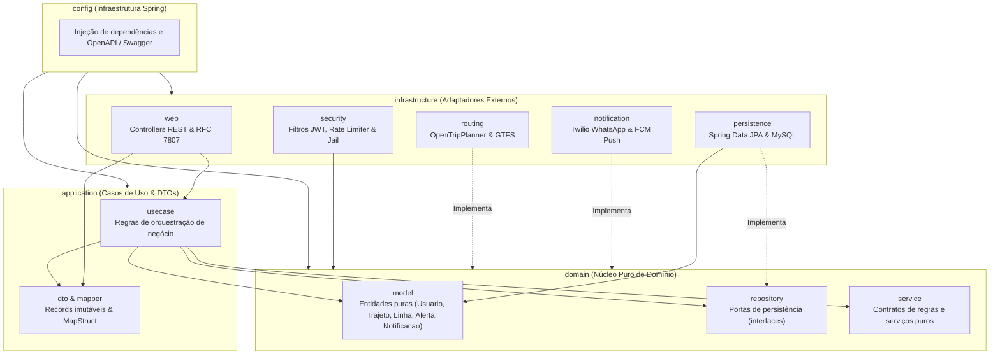
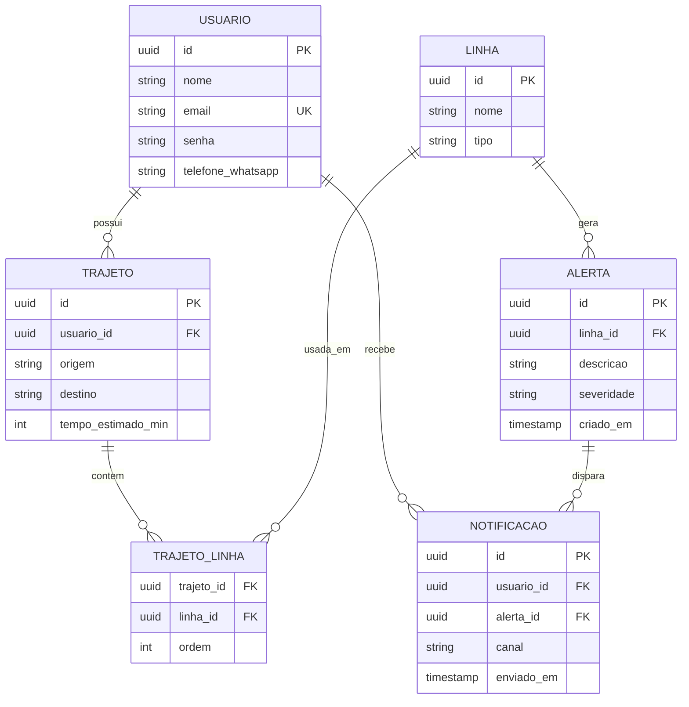
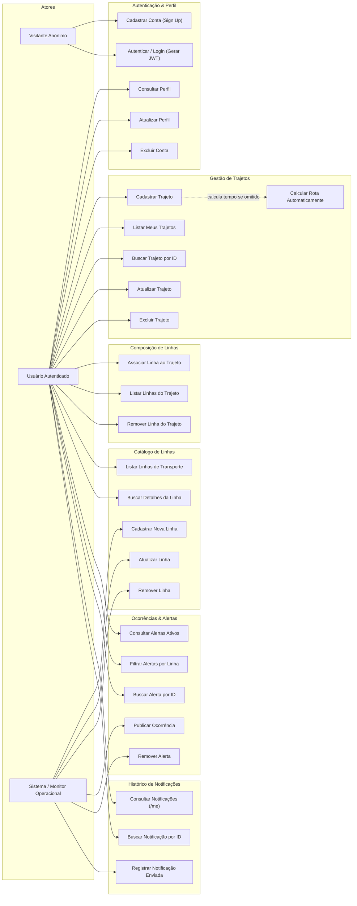
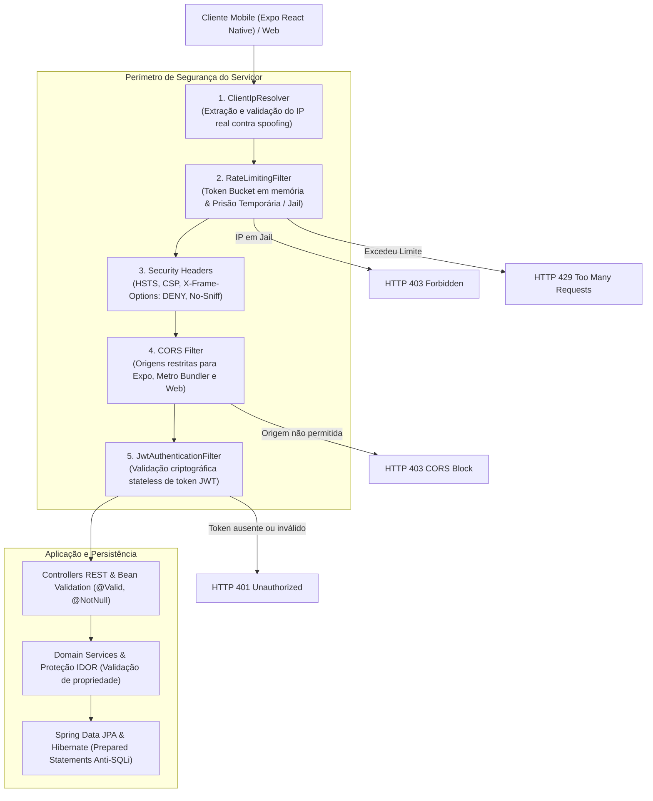

# Essarota — Sistema Inteligente de Alertas e Rotas de Transporte Público

O **Essarota** é uma plataforma backend robusta desenvolvida para monitorar linhas de transporte público (ônibus, metrô e trem), calcular tempos estimados de deslocamento e notificar passageiros em tempo real a respeito de falhas operacionais, atrasos, lentidão e paralisações nas linhas que compõem seus trajetos diários.

---

## 1. Visão Geral

| Aspecto | Detalhe |
| :--- | :--- |
| **Problema** | Usuários de transporte público enfrentam imprevisibilidade diária, descobrindo paralisações ou falhas operacionais apenas ao chegar nas estações ou pontos de ônibus. |
| **Solução** | Monitoramento contínuo das linhas utilizadas nos trajetos cadastrados pelo usuário, disparando alertas automatizados (WhatsApp ou Push Notification) antes e durante seus deslocamentos. |
| **Diferenciais** | Arquitetura limpa desacoplada de fornecedores externos, cálculo automatizado de tempo de percurso com integração a dados abertos GTFS via OpenTripPlanner, segurança defensiva contra abuso e autenticação moderna stateless. |
| **Ecossistema Técnico** | Java 21, Spring Boot 4.1, Spring Security, Spring Data JPA, Hibernate, MySQL, JJWT, MapStruct, SpringDoc OpenAPI (Swagger). |

---

## 2. Arquitetura do Sistema

O projeto segue estritamente os princípios de **Clean Architecture** (Arquitetura Limpa) e **Hexagonal Architecture** (Portas e Adaptadores), garantindo que as regras de negócio residam isoladas no núcleo e não dependam de frameworks, bancos de dados ou bibliotecas de terceiros.



### Estrutura de Camadas e Pacotes

```text
src/main/java/io/github/tinhascode/essarota/
│
├── EssarotaApplication.java             # Classe principal do Spring Boot
│
├── domain/                              # Camada 1: Núcleo puro (Java puro, zero dependências externas)
│   ├── model/                           # Entidades de negócio ricas e auto-validadas
│   ├── repository/                      # Interfaces (Portas) de acesso a dados
│   ├── exception/                       # Exceções de regras de negócio
│   └── service/                         # Contratos de serviços de domínio
│
├── application/                         # Camada 2: Casos de uso e orquestração
│   ├── usecase/                         # Fluxos de aplicação divididos por contexto
│   ├── dto/                             # Records imutáveis para transferência de dados
│   └── mapper/                          # Mapeamento DTO <-> Domínio via MapStruct
│
├── infrastructure/                      # Camada 3: Adaptadores e implementações concretas
│   ├── persistence/                     # Entidades JPA, repositórios Spring Data e implementações
│   ├── security/                        # Segurança defensiva, Token JWT, Rate Limiter e Filtros
│   ├── web/                             # Controllers REST e tratamento global de exceções
│   ├── notification/                    # Adaptadores de canais de envio (Twilio, Firebase Cloud Messaging)
│   ├── routing/                         # Integração de cálculo de trajetos (OpenTripPlanner)
│   └── monitoring/                      # Rotinas de verificação de status operacional das linhas
│
└── config/                              # Camada 4: Configuração de beans Spring e documentação OpenAPI
```

### Modelo de Dados Relacional (ERD)



---

## 3. Casos de Uso e Recursos da API

A API foi projetada para atender três perfis de atores: **Visitante Anônimo**, **Usuário Autenticado** (portador de Token Bearer JWT) e o **Sistema / Monitor Operacional**.



### Matriz de Endpoints REST

| Módulo | Método | Endpoint | Acesso | Descrição |
| :--- | :---: | :--- | :---: | :--- |
| **Auth** | `POST` | `/api/v1/auth/login` | Público | Autentica com e-mail e senha, retornando o token JWT. |
| **Usuários** | `POST` | `/api/v1/usuarios` | Público | Registra uma nova conta com senha criptografada via BCrypt. |
| **Usuários** | `GET` | `/api/v1/usuarios` | Autenticado | Lista todos os usuários cadastrados. |
| **Usuários** | `GET` | `/api/v1/usuarios/{id}` | Autenticado | Obtém detalhes do perfil do usuário por ID. |
| **Usuários** | `PUT` | `/api/v1/usuarios/{id}` | Autenticado | Atualiza dados cadastrais (nome, telefone, device token). |
| **Usuários** | `DELETE`| `/api/v1/usuarios/{id}` | Autenticado | Remove a conta do usuário e seus vínculos. |
| **Trajetos** | `POST` | `/api/v1/trajetos` | Autenticado | Cria um novo trajeto (origem, destino e tempo estimado). |
| **Trajetos** | `GET` | `/api/v1/trajetos` | Autenticado | Lista apenas os trajetos do usuário autenticado no token. |
| **Trajetos** | `GET` | `/api/v1/trajetos/{id}` | Autenticado | Obtém informações detalhadas de um trajeto específico. |
| **Trajetos** | `PUT` | `/api/v1/trajetos/{id}` | Autenticado | Atualiza informações do trajeto. |
| **Trajetos** | `DELETE`| `/api/v1/trajetos/{id}` | Autenticado | Exclui um trajeto existente. |
| **Trajeto/Linhas**| `POST` | `/api/v1/trajetos/{trajetoId}/linhas` | Autenticado | Associa uma linha ao trajeto com ordem de embarque. |
| **Trajeto/Linhas**| `GET` | `/api/v1/trajetos/{trajetoId}/linhas` | Autenticado | Lista todas as linhas que compõem o trajeto ordenadas. |
| **Trajeto/Linhas**| `DELETE`| `/api/v1/trajetos/{trajetoId}/linhas/{linhaId}` | Autenticado | Desassocia uma linha do trajeto. |
| **Linhas** | `GET` | `/api/v1/linhas` | Autenticado | Consulta catálogo de linhas (ônibus, trem, metrô). |
| **Linhas** | `GET` | `/api/v1/linhas/{id}` | Autenticado | Busca informações detalhadas de uma linha por ID. |
| **Linhas** | `POST` | `/api/v1/linhas` | Autenticado | Cadastra uma nova linha de transporte. |
| **Linhas** | `PUT` | `/api/v1/linhas/{id}` | Autenticado | Atualiza os dados de uma linha. |
| **Linhas** | `DELETE`| `/api/v1/linhas/{id}` | Autenticado | Remove uma linha do catálogo. |
| **Alertas** | `GET` | `/api/v1/alertas` | Autenticado | Lista alertas ativos (com suporte a filtro `?linhaId=`). |
| **Alertas** | `GET` | `/api/v1/alertas/{id}` | Autenticado | Consulta dados de um alerta por ID. |
| **Alertas** | `POST` | `/api/v1/alertas` | Autenticado | Registra ocorrência em uma linha (alta, média ou baixa). |
| **Alertas** | `DELETE`| `/api/v1/alertas/{id}` | Autenticado | Remove um alerta resolvido. |
| **Notificações**| `GET` | `/api/v1/notificacoes/me` | Autenticado | Histórico de notificações recebidas pelo usuário logado. |
| **Notificações**| `GET` | `/api/v1/notificacoes/{id}` | Autenticado | Detalhes de um envio de notificação específico. |
| **Notificações**| `POST` | `/api/v1/notificacoes` | Autenticado | Registra disparo de notificação (WhatsApp/Push). |

---

## 4. Arquitetura de Segurança Defensiva

O backend do **Essarota** foi concebido com uma estratégia de defesa em profundidade, combinando filtragem em borda, proteção contra sobrecarga, autenticação stateless e blindagem contra vulnerabilidades OWASP.



### 1. Autenticação Stateless via JWT
- Tokens assinados digitalmente usando HMAC-SHA256 (`jjwt-api` 0.12.6).
- Autenticação stateless no Spring Security (`SessionCreationPolicy.STATELESS`), desativando sessões HTTP em servidor e vulnerabilidades de CSRF.
- Senhas protegidas com algoritmo de derivação com hash lento **BCrypt** de 10 rounds.

### 2. Rate Limiting e Prisão Temporária de IP (Jail)
- **ClientIpResolver**: Inspeciona cabeçalhos de proxy reverso (`X-Forwarded-For`, `X-Real-IP`, etc.) extraindo o endereço IP real sanitizado contra cabeçalhos maliciosos.
- **Algoritmo Token Bucket**: Implementado em memória com controle de concorrência (`ConcurrentHashMap`).
  - **Rotas Críticas de Autenticação/Cadastro** (`/api/v1/auth/login`, `POST /api/v1/usuarios`): limite estrito de **10 requisições/minuto** por IP contra ataques de força bruta e credential stuffing.
  - **Rotas Gerais da API**: limite de **100 requisições/minuto** por IP.
- **Mecanismo de Jail**: Caso um IP viole o limite estabelecido por 3 vezes consecutivas, o sistema aciona uma prisão temporária de **15 minutos (900 segundos)**, devolvendo `HTTP 403 Forbidden` imediatamente antes mesmo de avaliar autenticação ou banco de dados.

### 3. Mitigação de SQL Injection (SQLi)
- Todo acesso à base é mediado por **Spring Data JPA** e **Hibernate**.
- Consultas executadas exclusivamente como **Prepared Statements** binários nativos no driver MySQL, impedindo a injeção de parâmetros maliciosos.
- Identificadores de entidades gerados com **UUID v4 (128 bits)**, impossibilitando explorações de enumeração sequencial ou injeções numéricas.

### 4. CORS Customizado para Expo e React Native
- Suporte nativo para emuladores e dispositivos móveis durante o ciclo de desenvolvimento:
  - Origens permitidas: `http://localhost:8081`, `http://127.0.0.1:8081`, `http://localhost:19000`, `http://localhost:19006`, `exp://*`, `http://10.0.2.2:*`, `http://192.168.*:*`.
  - Exposição de cabeçalhos de controle de taxa: `X-RateLimit-Limit`, `X-RateLimit-Remaining`, `X-RateLimit-Reset` e `Retry-After`.
  - Cache de preflight configurado para 1 hora (`maxAge = 3600L`).

### 5. Defesa contra Ataques de Negação de Serviço (DoS/Slowloris)
- `server.tomcat.connection-timeout=10000ms` (10 segundos para cortar conexões Slowloris lentas).
- `server.tomcat.keep-alive-timeout=15000ms` (evita saturação de descritores de rede).
- Limite estrito de conexões simultâneas e pool de threads controlado (`max-connections=1000`, `threads.max=200`).
- Limitação de tamanho de payload para 2 MB (`spring.servlet.multipart.max-request-size=2MB` e `server.tomcat.max-swallow-size=2MB`).

### 6. Cabeçalhos de Segurança HTTP (Security Headers)
- `X-Frame-Options: DENY`: Previne ataques de Clickjacking.
- `X-Content-Type-Options: nosniff`: Força cumprimento rigoroso do tipo de conteúdo `application/json`.
- `Strict-Transport-Security (HSTS)`: Garante tráfego estrito via HTTPS por 1 ano.
- `Referrer-Policy: strict-origin-when-cross-origin`: Resguarda metadados em requisições de origem cruzada.

### 7. Tratamento Padronizado de Erros (RFC 7807)
O `GlobalExceptionHandler` intercepta todas as exceções de domínio e validação de dados, retornando estruturas uniformes contendo `status`, `error`, `message`, `timestamp` e lista detalhada de campos inválidos.

---

## 5. Como Rodar o Projeto

### Pré-requisitos
Certifique-se de possuir em seu ambiente de desenvolvimento:
- **Java JDK 21** ou superior instalado (`java -version`).
- **Git** instalado.
- **MySQL Server 8.0+** em execução localmente ou via container Docker.
- Maven 3.9+ (opcional, pois o repositório já inclui o script `./mvnw`).

---

### Passo a Passo de Execução

#### 1. Clonar o Repositório
```bash
git clone https://github.com/tinhascode/essarota.git
cd essarota
```

#### 2. Configurar as Propriedades da Aplicação
Copie o arquivo de exemplo de propriedades para criar sua configuração local:

```bash
cp src/main/resources/application.properties.example src/main/resources/application.properties
```

Abra o arquivo `src/main/resources/application.properties` e defina suas credenciais do MySQL e a chave secreta do JWT:

```properties
spring.application.name=essarota

# Banco de Dados MySQL
spring.datasource.url=jdbc:mysql://localhost:3306/essarota?createDatabaseIfNotExist=true&useSSL=false&serverTimezone=America/Sao_Paulo&allowPublicKeyRetrieval=true
spring.datasource.username=seu_usuario_mysql
spring.datasource.password=sua_senha_mysql
spring.datasource.driver-class-name=com.mysql.cj.jdbc.Driver

# JPA e Hibernate
spring.jpa.hibernate.ddl-auto=update
spring.jpa.show-sql=true
spring.jpa.properties.hibernate.format_sql=true
spring.jpa.properties.hibernate.dialect=org.hibernate.dialect.MySQLDialect

# JWT (Chave com pelo menos 256 bits em Base64 ou texto puro seguro)
jwt.secret=minha_chave_secreta_super_segura_de_no_minimo_256_bits_essarota_token
jwt.expiration-hours=24
```

> **Dica**: Caso prefira rodar o MySQL via Docker, execute:
> ```bash
> docker run --name essarota-mysql -e MYSQL_ROOT_PASSWORD=root -e MYSQL_DATABASE=essarota -p 3306:3306 -d mysql:8.0
> ```

#### 3. Compilar e Iniciar a Aplicação
Utilizando o Maven Wrapper incluso:

```bash
# Dar permissão de execução ao wrapper (se necessário no Linux/macOS)
chmod +x ./mvnw

# Compilar e inicializar o servidor Spring Boot
./mvnw spring-boot:run
```

Para gerar o pacote executável (JAR) e executar diretamente:
```bash
./mvnw clean package -DskipTests
java -jar target/essarota-0.0.1-SNAPSHOT.jar
```

A aplicação subirá por padrão na porta `8080`.

---

## 6. Documentação Interativa da API

Com a aplicação em execução, acesse as interfaces de documentação e teste interativo:

- **Swagger UI (Interface Interativa)**: [http://localhost:8080/swagger-ui.html](http://localhost:8080/swagger-ui.html)
- **OpenAPI 3.0 (JSON)**: [http://localhost:8080/v3/api-docs](http://localhost:8080/v3/api-docs)
- **OpenAPI 3.0 (YAML)**: [http://localhost:8080/v3/api-docs.yaml](http://localhost:8080/v3/api-docs.yaml)
- **Postman Collection**: O arquivo JSON completo pronto para importação encontra-se no diretório `src/main/java/io/github/tinhascode/essarota/docs/essarota-postman-collection.json`.
- **Plano de Monitoramento de Saúde das Linhas**: Especificação técnica e fontes públicas no diretório [`src/main/java/io/github/tinhascode/essarota/docs/plano-monitoramento-saude-linhas.md`](src/main/java/io/github/tinhascode/essarota/docs/plano-monitoramento-saude-linhas.md).

Para testar rotas protegidas no Swagger:
1. Realize o cadastro em `POST /api/v1/usuarios`.
2. Efetue login em `POST /api/v1/auth/login` e copie o valor do campo `token`.
3. Clique no botão verde **Authorize** no topo do Swagger UI e insira o token no formato `Bearer seu_token_jwt`.

---

## 7. Autor

Desenvolvido por:

**Victor Martins da Silva Santos**  
- **GitHub**: [https://github.com/tinhascode](https://github.com/tinhascode)  
- **Repositório**: [https://github.com/tinhascode/essarota](https://github.com/tinhascode/essarota)
