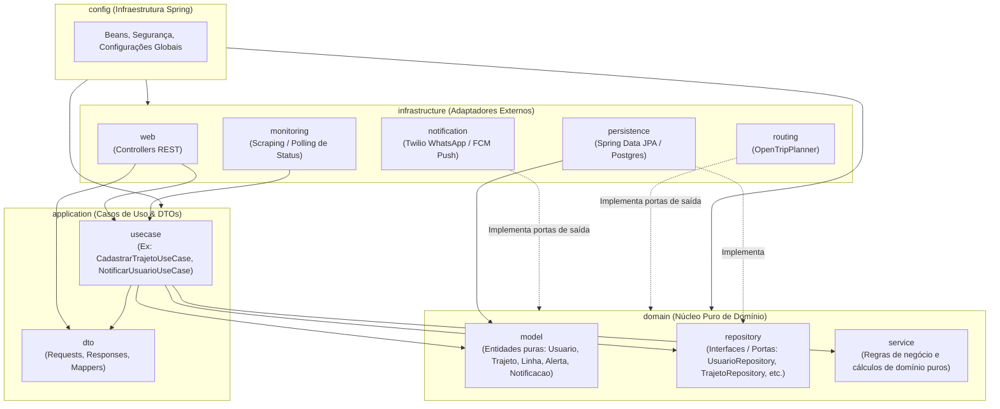

# Arquitetura de Pastas e Camadas

Este documento detalha e ilustra a estrutura de pastas e a arquitetura adotada no projeto **Essarota**, baseada nos princípios de **Clean Architecture / Hexagonal Architecture** conforme a especificação do sistema.

---

## 1. Diagrama de Arquitetura e Fluxo de Dependências

O núcleo do sistema é independente de tecnologias externas. As dependências apontam de fora para dentro (Inversão de Dependência):



---

## 2. Árvore de Diretórios do Projeto

Estrutura implementada sob o pacote base `io.github.tinhascode.essarota`:

```text
src/main/java/io/github/tinhascode/essarota/
│
├── EssarotaApplication.java             # Ponto de entrada da aplicação Spring Boot
│
├── domain/                              # Camada 1: Domínio puro (sem dependência de Spring/JPA)
│   ├── model/                           # Entidades ricas e imutáveis (ex: Usuario com nome, email, senha, etc.)
│   ├── repository/                      # Interfaces/Portas de repositório (ex: UsuarioRepository)
│   ├── exception/                       # Exceções de domínio (ex: DomainException, UsuarioNaoEncontradoException, CredenciaisInvalidasException)
│   └── service/                         # Contratos de serviços de domínio (ex: PasswordService, TokenService)
│
├── application/                         # Camada 2: Aplicação / Casos de Uso
│   ├── usecase/                         # Casos de uso específicos (Criar, Buscar, Listar, Atualizar, Deletar, AutenticarUsuario)
│   ├── dto/                             # Requests e Responses (records imutáveis: CriarUsuarioRequest, LoginRequest, etc.)
│   └── mapper/                          # Mappers de DTO <-> Domain com MapStruct (ex: UsuarioDtoMapper)
│
├── infrastructure/                      # Camada 3: Adaptadores técnicos externos
│   ├── persistence/
│   │   ├── entity/                      # Entidades JPA com @Entity (ex: UsuarioEntity)
│   │   ├── repository/                  # Repositórios Spring Data JPA (ex: SpringDataUsuarioRepository)
│   │   ├── mapper/                      # Mappers de Entity <-> Domain com MapStruct (ex: UsuarioEntityMapper)
│   │   └── UsuarioRepositoryImpl.java   # Implementação concreta da porta do domínio
│   ├── security/                        # Segurança da aplicação (SecurityConfig, JwtService, JwtAuthenticationFilter, PasswordServiceImpl)
│   ├── web/
│   │   ├── controller/                  # Endpoints REST (UsuarioController, AuthController)
│   │   └── exception/                   # GlobalExceptionHandler padronizado
│   ├── notification/                    # Adaptadores de envio (Twilio, Push FCM)
│   ├── routing/                         # Adaptadores OpenTripPlanner (GTFS)
│   └── monitoring/                      # Monitor de status das linhas
│
├── config/                              # Configurações do framework Spring (OpenApiConfig, etc.)
│
└── docs/                                # Documentação técnica e arquitetural
    ├── documentation-system.md          # Especificação técnica geral
    ├── arquitetura-pastas.md            # Este documento explicativo da arquitetura
    ├── postman-requests.md              # Documentação com corpos JSON e rotas para Postman/Insomnia
    └── essarota-postman-collection.json # Coleção pronta para importação direta no Postman
```

---

## 3. Descrição e Responsabilidade de Cada Camada

| Camada / Pacote | Responsabilidade | Dependências Permitidas |
| :--- | :--- | :--- |
| **`domain.model`** | Modelos puros e encapsulados (OOP rica, imutabilidade, validação de invariantes no construtor). | Nenhuma dependência externa ou de framework. Apenas Java standard. |
| **`domain.repository`** | Interfaces que declaram os contratos de persistência (Portas na Clean Architecture). | Depende apenas de `domain.model`. |
| **`domain.service`** | Serviços com lógica e regras de negócio puras que não pertencem exclusivamente a uma entidade. | Depende apenas de `domain.model`. |
| **`application.usecase`** | Orquestração dos fluxos de negócio. Executa casos de uso utilizando as portas do domínio. | Depende de `domain` e `application.dto`. |
| **`application.dto`** | Objetos de transferência de dados que cruzam os limites da aplicação. | Java standard / bibliotecas de validação. |
| **`infrastructure.persistence`** | Implementação das interfaces de repositório via Spring Data JPA, mapeando entidades relacionais para modelos de domínio. | Depende de `domain` e bibliotecas de persistência (JPA/Hibernate). |
| **`infrastructure.web`** | Controllers REST, conversão de requisições HTTP e retorno de respostas JSON. | Depende de `application.usecase` e `application.dto`. |
| **`infrastructure.notification`**| Adaptadores para serviços de envio de mensagens (WhatsApp via Twilio, Push via FCM). | Depende das portas definidas no domínio/aplicação. |
| **`infrastructure.routing`** | Cliente de comunicação e cálculo de rotas usando OpenTripPlanner e dados GTFS. | Depende das portas de roteamento do domínio. |
| **`infrastructure.monitoring`** | Mecanismos de agendamento (schedulers) e clientes para consultar status de linhas de transporte. | Dispara fluxos via `application.usecase`. |
| **`config`** | Configuração dos beans Spring, injeção de dependências e definições de ambiente. | Conhece todas as camadas para realizar a injeção (IoC/DI). |
