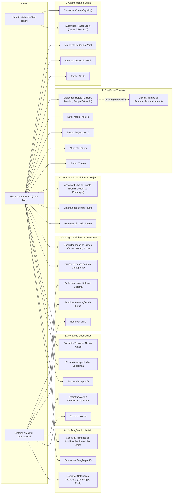

# Casos de Uso do Backend - Essarota

Este documento descreve e visualiza os Casos de Uso disponíveis no backend da aplicação **Essarota**, detalhando as capacidades e ações que o usuário (anônimo ou autenticado via JWT) e o sistema possuem na API REST.

---

## 1. Diagrama de Casos de Uso

---

## 2. Detalhamento das Ações do Usuário por Módulo

| Módulo | Ações Disponíveis para o Usuário | Endpoint REST |
| :--- | :--- | :--- |
| **Acesso & Conta** | • Criar uma nova conta com e-mail único e senha criptografada (BCrypt) • Realizar login para obter o token JWT • Visualizar seu cadastro, atualizar dados ou excluir sua conta | `POST /api/v1/usuarios` `POST /api/v1/auth/login` `GET, PUT, DELETE /api/v1/usuarios/{id}` |
| **Trajetos Pessoais** | • Cadastrar rotas rotineiras (ex: casa $\rightarrow$ trabalho) • Deixar o tempo de trajeto ser calculado automaticamente se omitido • Consultar apenas os seus próprios trajetos • Atualizar ou excluir qualquer um de seus trajetos | `POST /api/v1/trajetos` `GET /api/v1/trajetos` `GET, PUT, DELETE /api/v1/trajetos/{id}` |
| **Trajeto $\leftrightarrow$ Linhas** | • Montar a sequência de conduções do trajeto (ex: 1º Ônibus linha X, 2º Metrô linha Y) • Listar todas as linhas que compõem aquele trajeto específico • Desassociar uma linha do percurso | `POST /api/v1/trajetos/{trajetoId}/linhas` `GET /api/v1/trajetos/{trajetoId}/linhas` `DELETE /api/v1/trajetos/{trajetoId}/linhas/{linhaId}` |
| **Consulta de Linhas** | • Navegar pelo catálogo de linhas de transporte cadastradas na rede • Obter detalhes de tipo de modal (Metrô, Trem, Ônibus) de cada linha | `GET /api/v1/linhas` `GET /api/v1/linhas/{id}` |
| **Acompanhamento de Alertas** | • Consultar ocorrências ativas no transporte público • Filtrar alertas por uma linha de interesse para saber se há falha, lentidão ou paralisação | `GET /api/v1/alertas` `GET /api/v1/alertas?linhaId={id}` |
| **Notificações Recebidas** | • Consultar sua caixa de histórico de notificações recebidas (WhatsApp ou Push) • Inspecionar o detalhe de qual alerta disparou o aviso | `GET /api/v1/notificacoes/me` `GET /api/v1/notificacoes/{id}` |
