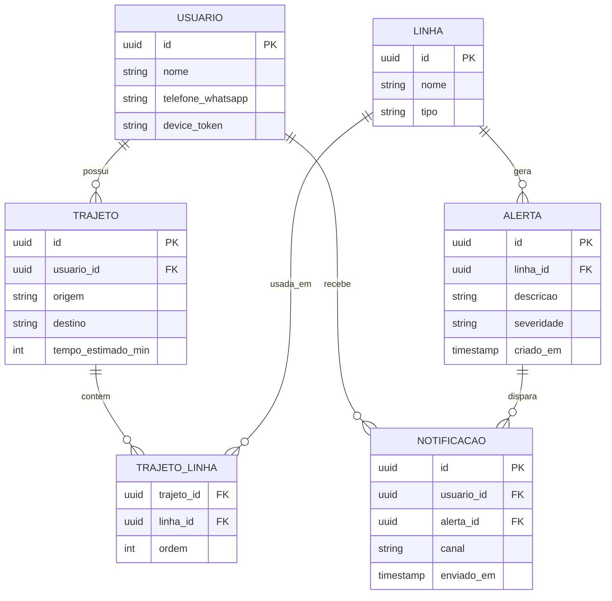

# Sistema de Alertas de Transporte Público.

Especificação técnica do projeto de portfólio: cadastro de trajetos (ônibus/trem) com cálculo de tempo estimado e notificação automática em caso de problema na linha.

---

## 1. Visão geral

|Item|Descrição|
|---|---|
|Problema|Usuários de transporte público não sabem em tempo real quando uma linha que usam diariamente está com problema (atraso, paralisação, lentidão)|
|Solução|Usuário cadastra o trajeto (linhas de ônibus/trem que usa), o sistema monitora o status dessas linhas e envia notificação (WhatsApp ou push) quando há mudança de status|
|Diferencial|Cálculo de trajeto e tempo estimado usando dados abertos (GTFS) via OpenTripPlanner, ao invés de cadastro manual simples|

---

## 2. Papel de cada linguagem

```
                    GTFS / status das linhas
                              |
                              v
                    +-------------------+
                    |       Java        |
                    | API, regras,      |
                    | monitoramento     |
                    +-------------------+
                       /              \
                      v                v
            +------------------+  +------------------+
            |      Python      |  |        Go        |
            | Microsserviço IA |  |      Infra:       |
            |   (opcional)     |  | scraping, scripts |
            +------------------+  +------------------+
```

### Java — backend principal

- API REST (Spring Boot)
- Regras de negócio: cadastro de usuário, trajeto, linhas
- Cálculo de rota/tempo estimado (integração com OpenTripPlanner, que também é Java)
- Monitor de status: compara status anterior x atual e decide quando notificar
- Orquestração do disparo de notificações (WhatsApp via Twilio, push via FCM)
- Persistência (PostgreSQL)

### Python — microsserviço isolado (opcional, só se envolver LLM)

- Chamado via HTTP a partir do Java, sem acoplamento direto
- Casos de uso: interpretar relatos livres de usuários sobre uma linha e classificar severidade/tipo de problema; resumir múltiplos alertas dispersos em uma notificação mais legível

### Go — infraestrutura

- Serviços de suporte de alta concorrência (ex: scraping paralelo de múltiplas fontes de status)
- Scripts de observabilidade / health checks
- Não é núcleo do domínio — é ferramenta de apoio

---

## 3. Modelo de dados (ERD)



### Descrição das entidades

- **USUARIO** — quem usa o sistema; guarda contato de WhatsApp e/ou token de push
- **TRAJETO** — um caminho que o usuário faz (origem → destino), com tempo estimado calculado
- **LINHA** — uma linha de ônibus ou trem (campo `tipo` diferencia)
- **TRAJETO_LINHA** — tabela associativa: um trajeto pode passar por várias linhas, em ordem (ex: ônibus até a estação, depois trem)
- **ALERTA** — evento de mudança de status gerado por uma linha
- **NOTIFICACAO** — registro de envio de um alerta a um usuário, por canal (whatsapp/push)

---

## 4. Arquitetura de pacotes (Java) — Clean Architecture / Hexagonal

```
com.seudominio.transportealertas
├── domain
│   ├── model            # Entidades de domínio puras (Usuario, Trajeto, Linha, Alerta, Notificacao)
│   ├── repository        # Interfaces (portas) — ex: UsuarioRepository, TrajetoRepository
│   └── service            # Regras de negócio puras (ex: cálculo de mudança de status)
├── application
│   ├── usecase           # Casos de uso (ex: CadastrarTrajetoUseCase, NotificarUsuarioUseCase)
│   └── dto                # Objetos de transferência entre camadas
├── infrastructure
│   ├── persistence        # Implementação JPA dos repositórios (adaptadores)
│   ├── web                 # Controllers REST (adaptadores de entrada)
│   ├── notification        # Adaptadores WhatsApp (Twilio) e Push (FCM)
│   ├── routing              # Integração com OpenTripPlanner
│   └── monitoring           # Monitor de status (polling/scraping de fontes)
└── config                  # Configuração Spring (beans, security, etc.)
```

**Por que essa separação:** o `domain` não depende de nada externo (nem de Spring, nem de JPA) — é onde vive a regra de negócio pura. `application` orquestra casos de uso chamando as interfaces do domínio. `infrastructure` é a única camada que conhece detalhes técnicos (banco, HTTP, filas). Isso permite trocar Twilio por outro provedor de WhatsApp, ou Postgres por outro banco, sem tocar na regra de negócio.

---

## 5. Aplicação dos princípios SOLID

|Princípio|Como aplicar no projeto|
|---|---|
|**S** — Single Responsibility|Cada classe tem um motivo pra mudar. Ex: `TrajetoService` só cuida de regras de trajeto; `NotificacaoService` só decide _quem_ notificar; o _como_ notificar fica em adaptadores separados (`WhatsAppSender`, `PushSender`)|
|**O** — Open/Closed|A interface `NotificacaoSender` permite adicionar um novo canal (ex: e-mail, SMS) sem alterar código existente — só criar uma nova implementação|
|**L** — Liskov Substitution|Qualquer implementação de `NotificacaoSender` (WhatsApp, Push) deve poder substituir outra sem quebrar o `NotificarUsuarioUseCase`|
|**I** — Interface Segregation|Evitar uma interface `Repository` genérica gigante. Separar `UsuarioRepository`, `TrajetoRepository`, `LinhaRepository`, cada uma só com os métodos que sua entidade precisa|
|**D** — Dependency Inversion|Os casos de uso (`application`) dependem de interfaces do `domain`, nunca de implementações concretas do `infrastructure`. O Spring injeta a implementação em tempo de execução|

---

## 6. Boas práticas de Clean Code

- **Nomes revelam intenção**: `verificarMudancaDeStatus()` em vez de `check()`; `TempoEstimadoEmMinutos` em vez de `tempo`
- **Funções pequenas e com um único nível de abstração**: um método de caso de uso deve ler como um resumo do fluxo, delegando detalhes para métodos privados ou outras classes
- **Evitar comentários que explicam o óbvio**: se o código precisa de comentário pra ser entendido, prefira refatorar (extrair método, renomear variável)
- **Tratamento de erros explícito**: usar exceções de domínio específicas (ex: `LinhaNaoEncontradaException`) em vez de deixar exceções técnicas (ex: `NullPointerException`) vazarem para as camadas superiores
- **Imutabilidade onde possível**: entidades de domínio com campos `final` e construtores que garantem estado válido (evita objetos "meio construídos")
- **Testes como documentação viva**: nomear testes descrevendo o comportamento (`deveNotificarUsuarioQuandoLinhaFicaComProblema`), não a implementação

---

## 7. Modelagem OOP das entidades de domínio (exemplo)

```java
public class Trajeto {
    private final UUID id;
    private final Usuario usuario;
    private final List<TrechoLinha> trechos;
    private final Duration tempoEstimado;

    public Trajeto(Usuario usuario, List<TrechoLinha> trechos, Duration tempoEstimado) {
        if (trechos == null || trechos.isEmpty()) {
            throw new TrajetoInvalidoException("Um trajeto precisa de ao menos um trecho");
        }
        this.id = UUID.randomUUID();
        this.usuario = usuario;
        this.trechos = List.copyOf(trechos);
        this.tempoEstimado = tempoEstimado;
    }

    public boolean utilizaLinha(Linha linha) {
        return trechos.stream().anyMatch(t -> t.getLinha().equals(linha));
    }
}
```

Esse exemplo mostra: encapsulamento (lista imutável exposta via `List.copyOf`), validação no construtor (nunca existe um `Trajeto` em estado inválido), e um método de domínio (`utilizaLinha`) que expressa uma regra de negócio, não só getters/setters anêmicos.

---

## 8. Fluxo principal (resumo)

1. Usuário cadastra trajeto → `CadastrarTrajetoUseCase` chama o serviço de rotas (OpenTripPlanner) e persiste
2. Monitor de status (rodando em loop) detecta mudança em uma `Linha` → gera um `Alerta`
3. `NotificarUsuarioUseCase` busca todos os usuários cujo trajeto usa aquela linha
4. Para cada usuário, escolhe o canal (`WhatsAppSender` ou `PushSender`) e envia a `Notificacao`
5. Registro da notificação enviada é persistido para histórico/auditoria