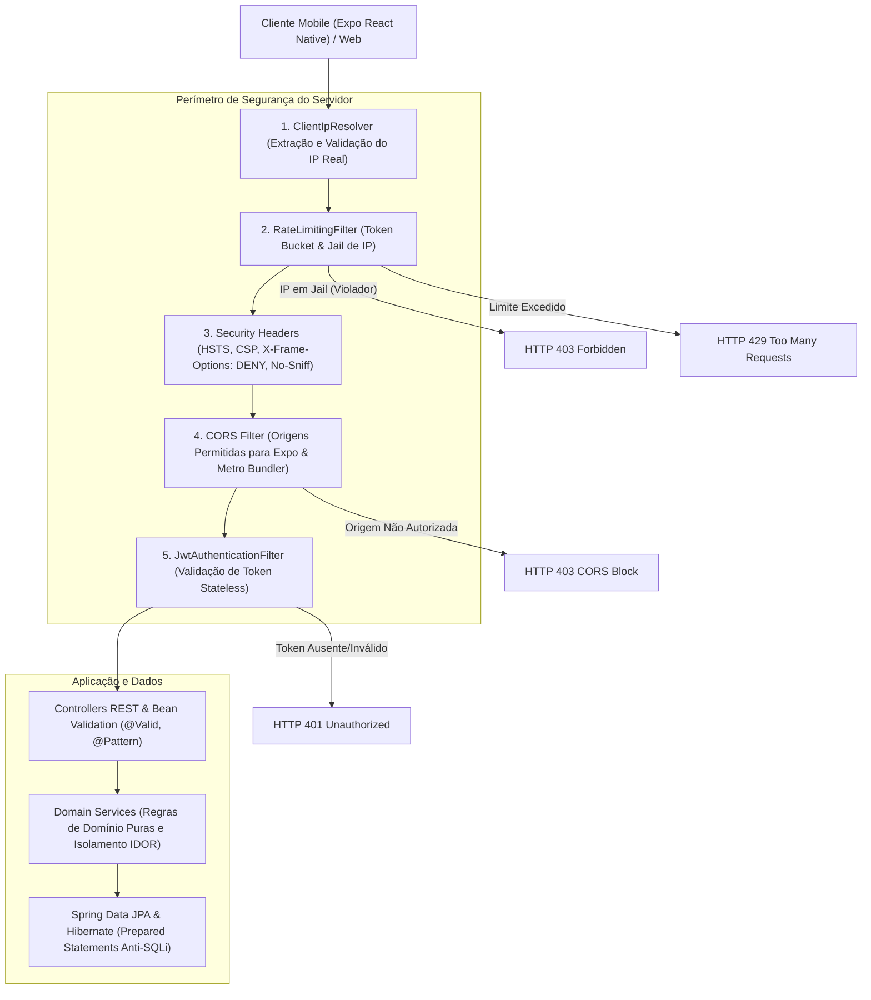
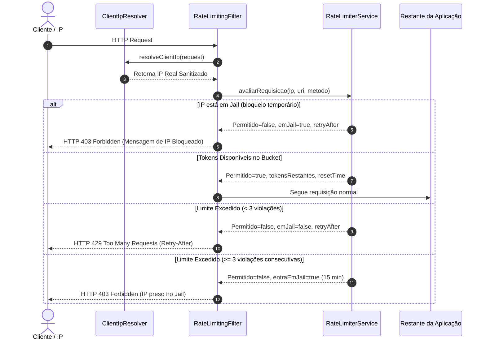

# Arquitetura de Segurança Defensiva - Essarota Backend

Este documento descreve as decisões de arquitetura e defesas técnicas implementadas no backend **Essarota** para proteger a aplicação contra acessos não autorizados, ataques de negação de serviço (DoS/DDoS), injeções de código (SQL Injection), requisições forjadas ou abusivas e garantir compatibilidade estrita e segura com o aplicativo móvel **Expo (React Native)**.

---

## 1. Visão Geral do Perímetro de Defesa

O fluxo de cada requisição HTTP passa por camadas sucessivas de inspeção antes de atingir as regras de negócio:

---

## 2. CORS Especializado para Expo (React Native)

### O Desafio
Em aplicativos móveis nativos desenvolvidos com React Native / Expo:
- Requisições nativas disparadas de dentro do app Android/iOS frequentemente não enviam o cabeçalho `Origin` tradicional de navegadores ou enviam esquemas próprios como `exp://` ou esquemas customizados.
- Durante o desenvolvimento com Expo Go ou emuladores, as requisições partem do Metro Bundler (`http://localhost:8081`, `http://10.0.2.2:8081` no emulador Android ou portas locais da sub-rede `http://192.168.*:*`).

### Solução Implementada
Na classe [`SecurityConfig`](../infrastructure/security/SecurityConfig.java), configuramos o `CorsConfigurationSource` com `setAllowedOriginPatterns`:
- **Origens Homologadas**: `http://localhost:8081`, `http://127.0.0.1:8081`, `http://localhost:19000`, `http://localhost:19006`, `exp://*`, `http://10.0.2.2:*`, `http://192.168.*:*`.
- **Métodos Restritos**: Apenas verbos HTTP essenciais (`GET`, `POST`, `PUT`, `DELETE`, `PATCH`, `OPTIONS`).
- **Headers Expostos**: Cabeçalhos informativos de segurança e controle de taxa (`X-RateLimit-Limit`, `X-RateLimit-Remaining`, `X-RateLimit-Reset`, `Retry-After`).
- **Cache Preflight**: Configurado `maxAge = 3600L` (1 hora) para reduzir chamadas desnecessárias de `OPTIONS`.

---

## 3. Rate Limiting e Bloqueio Automático de IP (Jail)

Para impedir ataques de força bruta, tentativas de credenciais vazadas e scraping abusivo:

### Componentes:
1. **[`ClientIpResolver`](../infrastructure/security/ClientIpResolver.java)**:
   - Inspeciona cabeçalhos de proxy reverso (`X-Forwarded-For`, `X-Real-IP`, `Proxy-Client-IP`) extraindo o primeiro IP legítimo.
   - Valida caracteres aceitos no endereço para mitigar ataques de injeção em cabeçalhos HTTP.
2. **[`RateLimiterService`](../infrastructure/security/RateLimiterService.java)**:
   - **Algoritmo**: Token Bucket em memória via `ConcurrentHashMap`.
   - **Rotas de Autenticação/Cadastro**: Limite rigoroso de **10 requisições/minuto** por IP (`/api/v1/auth/login`, `POST /api/v1/usuarios`).
   - **Rotas Gerais da API**: Limite de **100 requisições/minuto** por IP.
   - **Jail Temporário**: Caso um mesmo IP exceda o limite por 3 vezes consecutivas, ele é banido temporariamente por **15 minutos (900 segundos)**, recebendo resposta imediata `HTTP 403 Forbidden` sem onerar banco ou autenticação.
3. **[`RateLimitingFilter`](../infrastructure/security/RateLimitingFilter.java)**:
   - Filtro executado antes do filtro de autenticação JWT (`addFilterBefore`), poupando CPU de validar assinaturas criptográficas para clientes maliciosos.

---

## 4. Defesas Contra SQL Injection (SQLi)

1. **Abstração ORM e Consultas Parametrizadas**:
   - Todo o acesso a dados no projeto é mediado pelo Spring Data JPA e Hibernate.
   - Não há concatenação manual de strings em comandos SQL. Todas as cláusulas `WHERE`, chaves primárias e parâmetros de busca são transmitidos como **Prepared Statements** binários nativos no driver MySQL Connector/J.
2. **Imutabilidade e Tipagem Forte**:
   - Entidades identificadas por `UUID` (128 bits) eliminam parâmetros numéricos concatenáveis.
   - Validações de domínio (`domain/model`) e DTOs (`application/dto`) barram caracteres nulos ou formatos inválidos antes da camada de persistência.

---

## 5. Mitigação de DDoS, Slowloris e Buffer Overflow

Configurações aplicadas no [`application.properties`](../../resources/application.properties):

| Propriedade | Valor | Finalidade |
| :--- | :--- | :--- |
| `server.tomcat.connection-timeout` | `10000ms` (10s) | Defesa contra **Slowloris** (clientes lentos que abrem conexões e demoram para enviar cabeçalhos). |
| `server.tomcat.keep-alive-timeout` | `15000ms` (15s) | Fecha conexões ociosas evitando saturação de descritores de socket. |
| `server.tomcat.max-connections` | `1000` | Limita o total de conexões simultâneas aceitas pelo servidor. |
| `server.tomcat.threads.max` | `200` | Previne esgotamento de memória no pool de threads do Tomcat. |
| `server.tomcat.max-swallow-size` | `2MB` | Limita dados que o Tomcat descarta em conexões abortadas. |
| `spring.servlet.multipart.max-request-size` | `2MB` | Proteção contra payloads gigantes e exaustão de buffer de memória. |

---

## 6. Cabeçalhos de Segurança HTTP (Security Headers)

Injetados automaticamente pelo Spring Security em todas as respostas:

1. **`X-Frame-Options: DENY`**: Impede que a API seja embutida em `<frame>`, `<iframe>` ou `<object>`, prevenindo ataques de Clickjacking.
2. **`X-Content-Type-Options: nosniff`**: Impede que clientes/navegadores façam MIME-sniffing, forçando o estrito cumprimento de `application/json`.
3. **`Strict-Transport-Security (HSTS)`**: Força o tráfego estritamente via HTTPS por no mínimo 1 ano (`maxAge = 31536000`), incluindo subdomínios.
4. **`Referrer-Policy: strict-origin-when-cross-origin`**: Protege URLs internas contra vazamento de metadados em requisições externas.
